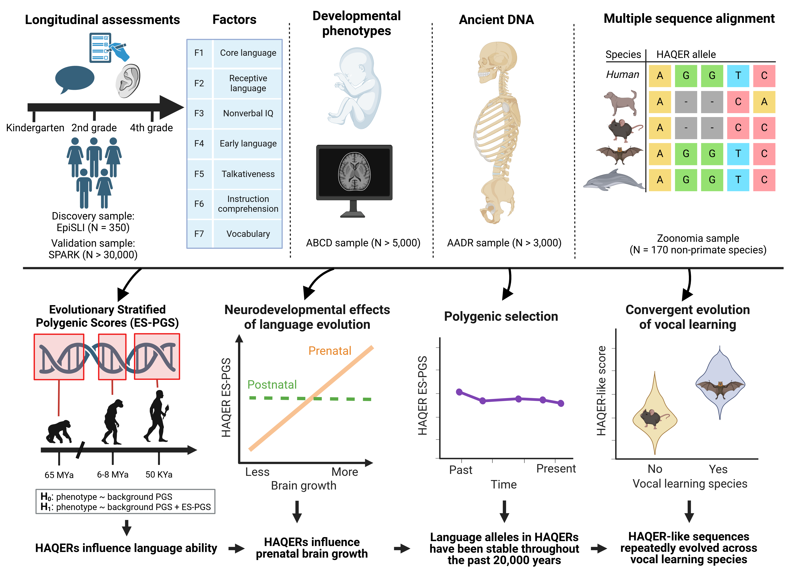

# Rapidly evolved genomic regions shape individual language abilities in contemporary humans

This repo contains the code necessary to reproduce all analyses for this [paper](LINK)

All statistics reported can be reproduced using code in the `code/compute_stats_and_make_figures`. The `code/process_data` folder includes code for processing the individual level genetic data, which can't be reproduced without approved access to these datasets but are included for transparency.

The graphical abstract below provides an overview of the project and some of its key findings.

